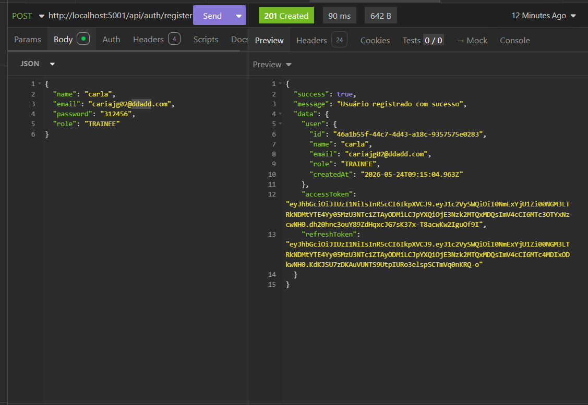

# Bug Report: AD_HOC-01 - Módulo de Autenticação e Acesso (JWT)

**Título:** Falha na validação de formato de e-mail no Cadastro  
**Data do Teste:** 19/05/2026  

---

## 1. Descrição
A API não está realizando a validação de sintaxe para o campo `email` no momento do registro de um novo usuário. O sistema aceita e-mails com formatos incorretos ou inexistentes (ex: `caria02@ddadd.com`), o que compromete a integridade do banco de dados e impede o envio bem-sucedido de códigos de verificação necessários para o fluxo de ativação da conta.

## 2. Severidade
- [ ] **Crítico:** Trava o sistema ou compromete a segurança.
- [x] **Maior:** Causa erro de lógica na regra de negócio (Dados inválidos persistidos).
- [ ] **Menor:** Erros visuais ou de interface.

## 3. Passos para Reproduzir
1. Acessar o endpoint de registro (`http://localhost:5001/api/auth/register`) no Insomnia.
2. Inserir um JSON com um e-mail em formato inválido ou inexistente:
   ```json
   {
     "name": "carla",
     "email": "caria02@ddadd.com",
     "password": "312456",
     "role": "TRAINEE"
   }

3. Enviar a requisição (POST)
4. Analisar o retorno da API e os logs do terminal:

## 4. Resultado Esperado
O sistema deveria validar o formato do e-mail e, caso este não seja um formato válido ou não seja possível verificar a existência do domínio, retornar um erro 400 Bad Request com uma mensagem clara, como: "E-mail inválido".

## 5. Resultado Atual
A API aceita o e-mail mal formatado, retorna o status 201 Created e persiste o usuário no banco de dados como se a informação estivesse correta.

## 6. Ambiente de Teste
* **Dispositivo:** Computador local (Ryzen 7 5700U, 32GB RAM)
* **Ferramenta de API:** Insomnia
* **Servidor:** Docker 

## 7. Evidências
