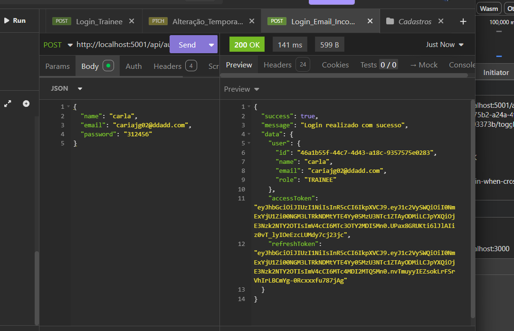

# Bug Report: AD_HOC-03 - Módulo de Autenticação e Acesso (JWT)

**Título:** Falha na validação de formato de e-mail no Login  
**Data do Teste:** 22/05/2026  

---

## 1. Descrição
O endpoint de login não está aplicando validações de formato para o campo `email`. Como o sistema permitiu anteriormente o cadastro de e-mails em formato inválido (ex: `caria02@ddadd.com`), ele agora aceita essas mesmas entradas no login, validando apenas a credencial contra o banco de dados. Isso viola as boas práticas de segurança e integridade, permitindo que e-mails tecnicamente inexistentes ou mal formatados sejam utilizados para obter tokens de acesso (JWT).

## 2. Severidade
- [ ] **Crítico:** Trava o sistema ou compromete a segurança.
- [x] **Maior:** Causa erro de lógica na regra de negócio (Aceitação de dados corrompidos como válidos).
- [ ] **Menor:** Erros visuais ou de interface.

## 3. Passos para Reproduzir
1. Realizar o login via `POST /api/auth/login` utilizando um e-mail que foi cadastrado previamente em formato inválido.
2. Observar que, apesar de o e-mail não seguir um padrão RFC válido, a API processa a requisição.
3. Verificar que o sistema retorna `200 OK` e entrega os tokens de acesso (accessToken e refreshToken), legitimando o usuário com o e-mail corrompido.

## 4. Resultado Esperado
O sistema deveria aplicar a mesma política de validação de e-mail no login que deveria existir no cadastro. Se o e-mail não estiver em um formato válido, a requisição de login deveria ser rejeitada com `400 Bad Request` antes mesmo de consultar o banco de dados, protegendo a integridade da sessão.

## 5. Resultado Atual
A API aceita o e-mail mal formatado e efetua o login normalmente, criando uma sessão válida para um usuário que, por definição de integridade, não deveria ter sido registrado no sistema.

## 6. Ambiente de Teste
* **Dispositivo:** Computador local
* **Ferramenta de API:** Insomnia
* **Servidor:** Docker

## 7. Evidências
