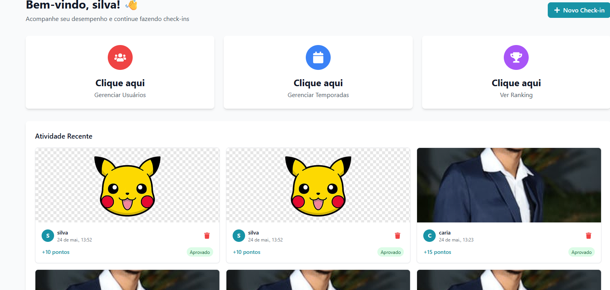
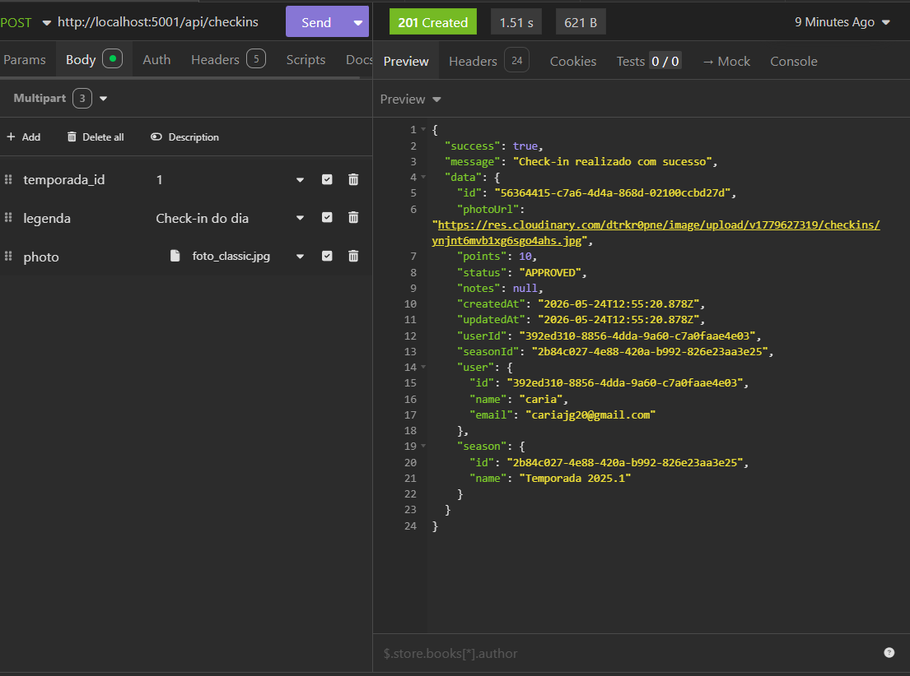

# Bug Report: RF-01 - Módulo de Check-in (Mídia)

**Título:** Falha na restrição de envio de mídia duplicada (Violação do RF-04)  
**Data do Teste:** 17/05/2026  

---

## 1. Descrição
O sistema não implementa a validação para impedir o envio de imagens (fotos) repetidas pelo mesmo usuário ou para a mesma temporada. Conforme o caso de teste TC10 (RF-04), o sistema deveria restringir o envio de um arquivo exato de imagem que já foi enviado anteriormente, retornando um erro, porém o sistema permite múltiplos uploads do mesmo arquivo sem qualquer bloqueio.

## 2. Severidade
- [ ] **Crítico:** Trava o sistema ou compromete a segurança.
- [x] **Maior:** Causa erro de lógica na regra de negócio (Persistência de arquivos duplicados).
- [ ] **Menor:** Erros visuais ou de interface.

## 3. Passos para Reproduzir
1. **Configuração inicial:** Utilizando o Insomnia, configure uma requisição do tipo `POST` no endpoint `http://localhost:5001/api/checkins` utilizando o formato `Multipart Form` para permitir o envio do arquivo `photo`.
2. **Execução do upload original:** Selecione um arquivo de imagem (ex: `photo.jpg`) e envie a requisição. Verifique no painel `Preview` se o servidor retornou o **Status 201 (Created)**, confirmando a persistência do check-in com um ID único.
3. **Simulação da duplicidade:** Sem alterar a configuração da requisição, envie novamente o **mesmo arquivo** (`photo.jpg`) para o mesmo endpoint.
4. **Análise do comportamento:** Observe que a API, em vez de validar a unicidade da mídia, processa o novo `POST` e retorna um **Status 201 (Created)**. 
5. **Identificação da falha:** Verifique no corpo da resposta que uma nova entrada foi criada com sucesso no banco de dados, possuindo um novo ID, o que confirma que o sistema permite múltiplas instâncias da mesma mídia para a mesma temporada.

## 4. Resultado Esperado
O sistema deve verificar o hash da imagem ou comparar o arquivo enviado com as mídias já existentes no banco de dados. Ao detectar uma duplicidade, a requisição deve ser interrompida com status `400 Bad Request` e a mensagem: "Esta imagem já foi enviada anteriormente".

## 5. Resultado Atual
A API retorna `201 Created` para todas as tentativas de upload do mesmo arquivo, persistindo múltiplas vezes a mesma mídia no sistema e inflando o armazenamento desnecessariamente.

## 6. Ambiente de Teste
* **Dispositivo:** Computador local (Ryzen 7 5700U, 32GB RAM)
* **Ferramenta de API:** Insomnia
* **Servidor:** Docker

## 7. Evidências
**Saída observada:**

