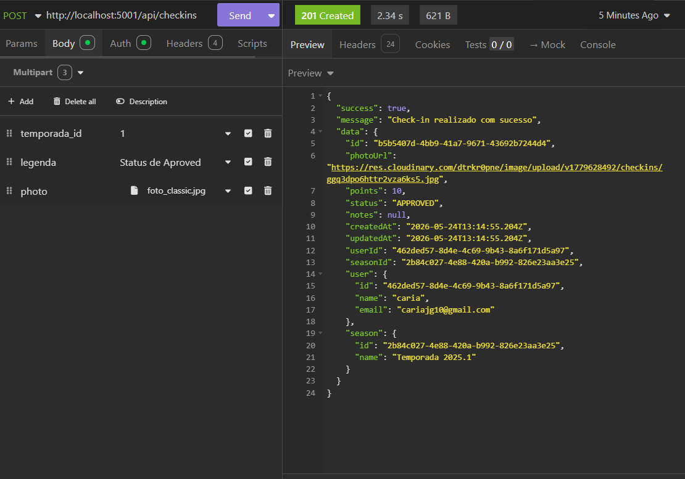

# Bug Report: RF-02 - Módulo de Check-in (Mídia)

**Título:** Status de Check-in incorreto no momento da criação (Violação do RF-05)  
**Data do Teste:** 17/05/2026  

---

## 1. Descrição
O sistema não respeita o fluxo de estado definido pelo requisito funcional RF-05. Ao criar um novo check-in, o sistema deve atribuir obrigatoriamente o status **PENDENTE** para que a mídia passe por uma etapa de moderação. Entretanto, a API está retornando `status: "APPROVED"` imediatamente após a requisição POST, permitindo que registros não moderados entrem diretamente no ranking.

## 2. Severidade
- [ ] **Crítico:** Trava o sistema ou compromete a segurança.
- [x] **Maior:** Causa erro de lógica na regra de negócio (Bypass de moderação).
- [ ] **Menor:** Erros visuais ou de interface.

## 3. Passos para Reproduzir
1. Acessar o endpoint `POST http://localhost:5001/api/checkins` no Insomnia.
2. Configurar o `Multipart Form` com os campos `temporada_id`, `legenda` e `photo`.
3. Enviar a requisição.
4. Analisar o objeto `data` no retorno JSON da API.

## 4. Resultado Esperado
O check-in deve ser criado com o status **PENDENTE**, exigindo uma ação posterior de um administrador para que o status seja alterado para "APPROVED" e os pontos sejam contabilizados.

## 5. Resultado Atual
A API retorna `201 Created` e o campo `status` já vem preenchido como `"APPROVED"`, invalidando a necessidade de moderação.

## 6. Ambiente de Teste
* **Dispositivo:** Computador local
* **Ferramenta de API:** Insomnia
* **Servidor:** Docker

## 7. Evidências
**Saída observada:**

