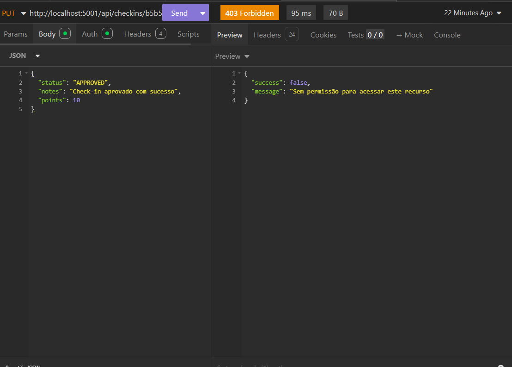

# Bug Report: RF-03 - Módulo de Check-in (Mídia)

**Título:** Falha na autorização de edição check-in próprio (Violação do RF-06)  
**Data do Teste:** 18/05/2026  

---

## 1. Descrição
O sistema apresenta um erro de controle de acesso (Bypass de permissão) onde usuários com a role "MEMBER" são impedidos de realizar operações de edição (`PUT`) em registros de check-in que lhes pertencem. Conforme o RF-06, o sistema deve permitir que o proprietário do check-in manipule seu próprio registro.

## 2. Severidade
- [ ] **Crítico:** Trava o sistema ou compromete a segurança.
- [x] **Maior:** Causa erro de lógica na regra de negócio (Bloqueio de ação autorizada).
- [ ] **Menor:** Erros visuais ou de interface.

## 3. Passos para Reproduzir
1. Autenticar com uma conta com role "MEMBER".
2. Realizar um check-in válido e para obter o ID (`GET http://localhost:5001/api/checkins`) estará escrito (`id:"id do check-in estara aqui"`).
3. Acessar o endpoint de edição/aprovação (`PUT http://localhost:5001/api/checkins/:id_do_CheCck-in`) no Insomnia.
4. Enviar a requisição para o recurso que pertence a este mesmo usuário.
5. Analisar o status da resposta.

## 4. Resultado Esperado
O sistema deve autorizar a operação e retornar `200 OK` (ou `204 No Content`), permitindo que o usuário gerencie seu próprio histórico de check-ins.

## 5. Resultado Atual
A API retorna `403 Forbidden` com a mensagem `"Sem permissão para acessar este recurso"`, impedindo o usuário de realizar ações básicas de gestão sobre os seus próprios registros.

## 6. Ambiente de Teste
* **Dispositivo:** Computador local
* **Ferramenta de API:** Insomnia
* **Servidor:** Docker 

## 7. Evidências
**Saída observada:**

