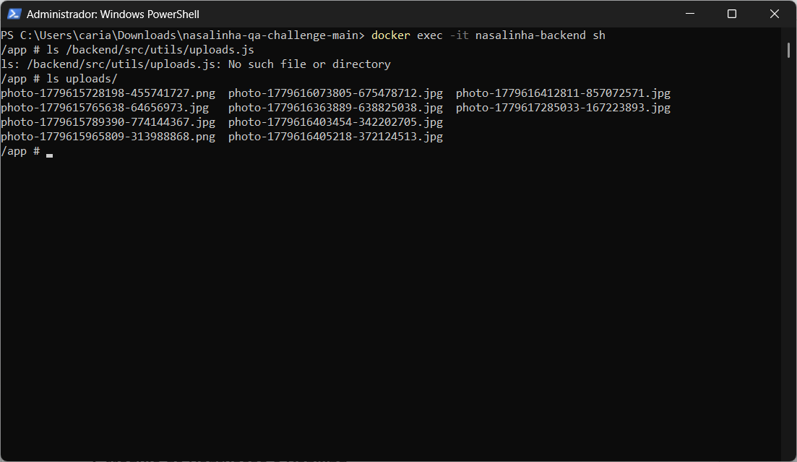

# Bug Report: RNF-02 - Módulo de Check-in (Infraestrutura)

**Título:** Falha na remoção de arquivos temporários após upload (Violação do RNF-02)  
**Data do Teste:** 18/05/2026  

---

## 1. Descrição
O sistema não está realizando a limpeza do diretório de armazenamento local (`/app/uploads/`) após o processamento dos uploads. Conforme o RNF-02, arquivos temporários devem ser removidos do servidor local imediatamente após a conclusão do upload para a nuvem (Cloudinary) ou após a ocorrência de qualquer erro de validação. O acúmulo observado indica uma falha na gestão de ciclo de vida de arquivos no servidor Docker.

## 2. Severidade
- [ ] **Crítico:** Trava o sistema ou compromete a segurança.
- [x] **Maior:** Causa erro de infraestrutura (Esgotamento de armazenamento do servidor).
- [ ] **Menor:** Erros visuais ou de interface.

## 3. Passos para Reproduzir
1. Realizar diversos uploads de imagens via endpoint `POST /api/checkins`.
2. Acessar o terminal do container Docker via CLI (`docker exec -it <container_id> sh`).
3. Navegar até o diretório de uploads: `cd /app/uploads/`.
4. Listar os arquivos contidos no diretório utilizando `ls`.
5. Comparar a quantidade de arquivos listados com o número de operações de upload realizadas.

## 4. Resultado Esperado
O diretório `uploads/` deve permanecer limpo ou conter apenas arquivos de transações que ainda estão em processamento ativo. Após o envio bem-sucedido ou falha, o arquivo deve ser deletado do disco local do container.

## 5. Resultado Atual
O diretório `/app/uploads/` está retendo todos os arquivos enviados, mesmo após o sucesso da operação (retorno 201), confirmando a ausência de uma rotina de limpeza (`fs.unlink` ou equivalente) no código.

## 6. Ambiente de Teste
* **Dispositivo:** Servidor (Container Docker)
* **Ambiente:** Linux (Alpine/Linux dentro do Docker)
* **Localização dos arquivos:** `/app/uploads/`

## 7. Evidências
* **Comando executado:** `ls uploads/`
* **Saída observada:**
