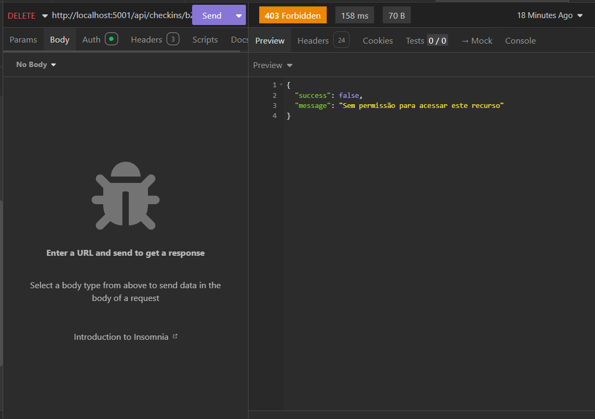

# Bug Report: RF-03 - Módulo de Check-in (Mídia)

**Título:** Falha na autorização para exclusão de check-in próprio (Violação do RF-06)
**Data do Teste:** 18/05/2026

---

## 1. Descrição
O sistema apresenta um erro de controle de acesso (Bypass de permissão) onde usuários com a role "MEMBER" são impedidos de realizar a exclusão (`DELETE`) de registros de check-in que lhes pertencem. Conforme o RF-06, o sistema deve garantir que o proprietário do check-in tenha autonomia para gerenciar e excluir seu próprio registro.

## 2. Severidade
- [ ] **Crítico:** Trava o sistema ou compromete a segurança.
- [x] **Maior:** Causa erro de lógica na regra de negócio (Bloqueio de ação autorizada).
- [ ] **Menor:** Erros visuais ou de interface.

## 3. Passos para Reproduzir
1. Autenticar com uma conta com role "MEMBER".
2. Identificar o ID de um check-in criado por este mesmo usuário.
3. Acessar o endpoint de exclusão (`DELETE http://localhost:5001/api/checkins/:id`) no Insomnia.
4. Enviar a requisição para o recurso de sua propriedade.
5. Analisar o status da resposta.

## 4. Resultado Esperado
O sistema deve processar a exclusão e retornar `200 OK` (ou `204 No Content`), confirmando que o usuário removeu seu próprio registro com sucesso.

## 5. Resultado Atual
A API retorna `403 Forbidden` com a mensagem `"Sem permissão para acessar este recurso"`, impedindo o usuário de realizar a exclusão de seus próprios registros.

## 6. Ambiente de Teste
* **Dispositivo:** Computador local
* **Ferramenta de API:** Insomnia
* **Servidor:** Docker

## 7. Evidências
* **Saída observada:**

