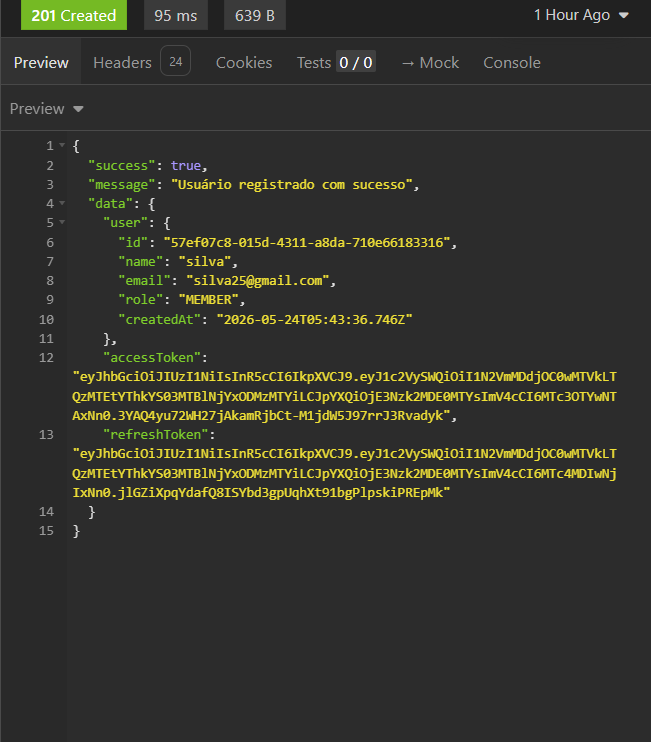

# Bug Report: RF-001 - Módulo de Autenticação e Acesso (JWT)

**Título:** Retorno indevido de token de acesso no Cadastro (Bypass de Verificação)  
**Data do Teste:** 16/05/2026  

---

## 1. Descrição
Ao realizar o cadastro de um novo usuário com sucesso, a API está retornando imediatamente os tokens de autenticação (`accessToken` e `refreshToken`) no corpo da resposta JSON. Isso viola o fluxo de ativação, permitindo que o usuário acesse o sistema e faça requisições autenticadas sem realizar a confirmação de e-mail obrigatória exigida pelas regras de negócio.

## 2. Severidade
- [ ] **Crítico** (Trava o sistema)
- [x] **Maior** (Causa erro de lógica na regra de negócio) [cite: 44]
- [ ] **Menor** (Erros visuais)

## 3. Passos para Reproduzir
1. Acessar o endpoint de registro (`http://localhost:5001/api/auth/register`) no Insomnia.
2. Inserir os seguintes dados de um novo usuário no formato JSON no corpo da requisição:
   ```json
   {
     "name": "silva",
     "email": "silva25@gmail.com",
     "password": "senha3124",
     "role": "MEMBER"
   }
   
3. Enviar a requisição (POST)
4. Analisar o retorno da API e os logs do terminal:

## 4. Resultado Esperado
O sistema deveria criar o usuário e retornar apenas uma mensagem de sucesso, pois o status inicial da conta deve ser obrigatoriamente PENDENTE. Os tokens de acesso não deveriam ser gerados ou expostos nesta etapa, visto que o sistema deve bloquear o acesso de qualquer usuário que não tenha confirmado o código de verificação enviado por e-mail.

## 5. Resultado Atual
A API retorna o Status Code 201 Created, mas expõe indevidamente os objetos accessToken e refreshToken dentro do objeto data. O usuário recém-criado já recebe a credencial de acesso sem validar a conta.

## 6. Ambiente de Teste
* **Dispositivo:** Computador local (Ryzen 7 5700U, 32GB RAM)
* **Ferramenta de API:** Insomnia
* **Servidor:** Docker 

## 7. Evidências
**Saída observada:**

