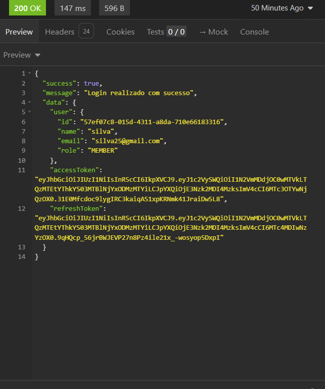

# Bug Report: RF-002 - Módulo de Autenticação e Acesso (JWT)

**Título:** Falha no bloqueio de login para contas com status PENDENTE (Violação do RF-02)  
**Data do Teste:** 16/05/2026  

---

## 1. Descrição
O sistema falha em implementar a restrição de acesso obrigatória para usuários que ainda não confirmaram o código de verificação enviado por e-mail. Conforme o requisito funcional RF-02, o sistema deve bloquear o acesso de qualquer usuário não verificado. Entretanto, ao enviar as credenciais no endpoint de login, o sistema processa a autenticação normalmente e retorna os tokens de acesso.

## 2. Severidade
- [ ] **Crítico:** Trava o sistema ou compromete a segurança.
- [x] **Maior:** Causa erro de lógica na regra de negócio.
- [ ] **Menor:** Erros visuais ou de interface.

## 3. Passos para Reproduzir
1. Realizar o cadastro de um novo usuário via `POST /api/auth/register` (conta criada como PENDENTE).
2. Não executar o fluxo de verificação via e-mail.
3. Acessar o endpoint de Login (`http://localhost:5001/api/auth/login`) no Insomnia.
4. Inserir as credenciais do usuário recém-cadastrado:
   ```json
   {
     "name": "silva",
     "email": "silva25@gmail.com",
     "password": "senha3124"
   }

3. Enviar a requisição (POST)
4. Analisar o retorno da API e os logs do terminal:

## 4. Resultado Esperado
O sistema deve negar o acesso e retornar um status de erro (como `401 Unauthorized`), acompanhado obrigatoriamente da seguinte mensagem, conforme definido pelo RF-02: 
`"Por favor, verifique sua conta para continuar"`

## 5. Resultado Atual
A API retorna `200 OK` e entrega os tokens de sessão (`accessToken` e `refreshToken`), concedendo acesso indevido a um usuário que não completou a verificação.

## 6. Ambiente de Teste
* **Dispositivo:** Computador local (Ryzen 7 5700U, 32GB RAM)
* **Ferramenta:** Insomnia
* **Servidor:** Docker

## 7. Evidências
**Saída observada:**
