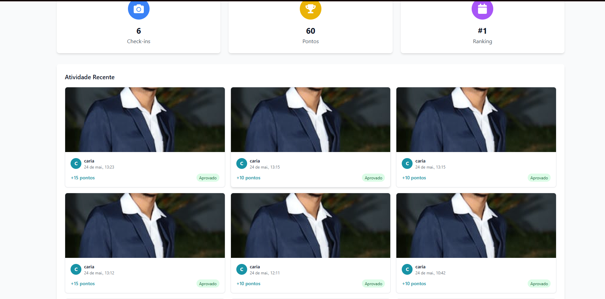

# Bug Report: RF-01 - Módulo de Pontuação e Ranking

**Título:** Falha na atualização do saldo de pontos ao editar check-in aprovado (Violação do RF-07)
**Data do Teste:** 20/05/2026

---

## 1. Descrição
O sistema apresenta uma falha de lógica na persistência do saldo de pontos do usuário. Quando um check-in previamente aprovado tem seus pontos editados (ex: de 10 para 15), a API atualiza o valor no registro do check-in, mas falha em atualizar o saldo total do usuário. O sistema apenas processa o incremento de pontos no momento do upload inicial da imagem, ignorando ajustes manuais subsequentes na pontuação.

## 2. Severidade
- [ ] **Crítico:** Trava o sistema ou compromete a segurança.
- [x] **Maior:** Causa erro de lógica na regra de negócio (Inconsistência no ranking).
- [ ] **Menor:** Erros visuais ou de interface.

## 3. Passos para Reproduzir
1. Realizar um check-in que resulte em uma pontuação inicial (ex: 10 pontos).
2. Confirmar o saldo total do usuário no banco/ranking.
3. Acessar o endpoint `PUT http://localhost:5001/api/checkins/:id` para atualizar os pontos do check-in (ex: alterar para 15 pontos).
4. Enviar a requisição e confirmar o sucesso (`200 OK`) na atualização do recurso.
5. Verificar o saldo total do usuário novamente.

## 4. Resultado Esperado
O sistema deve calcular a diferença entre a pontuação antiga e a nova (neste caso, +5) e refletir automaticamente essa alteração no saldo total do usuário, mantendo o ranking sempre sincronizado com os valores reais dos check-ins.

## 5. Resultado Atual
A API altera apenas o valor pontual daquele check-in específico no registro, mas o saldo total do usuário permanece inalterado, gerando uma disparidade entre a soma dos check-ins e o saldo exibido no ranking.

## 6. Ambiente de Teste
* **Dispositivo:** Computador local
* **Ferramenta de API:** Insomnia
* **Servidor:** Docker 

## 7. Evidências
* **Saída observada:**

