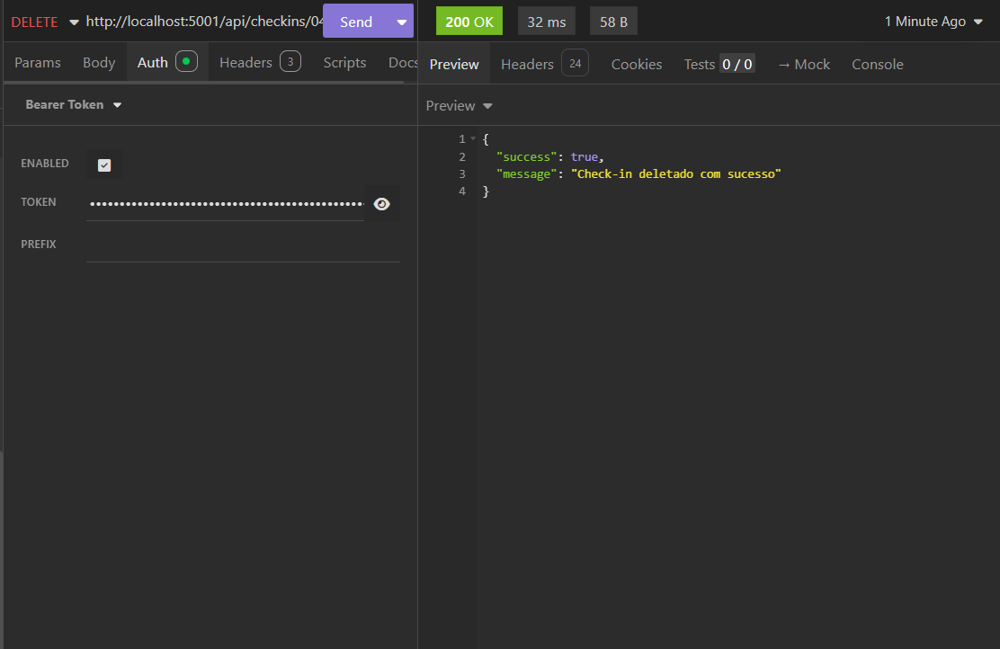

# Bug Report: RF-02 - Módulo de Pontuação e Ranking

**Título:** Falha na subtração de pontos do saldo do usuário ao excluir check-in (Violação do RF-02)
**Data do Teste:** 22/05/2026

---

## 1. Descrição
O sistema apresenta uma falha de lógica na gestão da pontuação. Embora a API execute corretamente a exclusão (`DELETE`) do check-in no banco de dados, ela ignora a necessidade de atualizar o saldo total de pontos do usuário, não subtraindo a pontuação que aquele check-in havia conferido anteriormente. Isso resulta em um saldo inflado e inconsistente no sistema de ranking.

## 2. Severidade
- [ ] **Crítico:** Trava o sistema ou compromete a segurança.
- [x] **Maior:** Causa erro de lógica na regra de negócio (Inconsistência no ranking).
- [ ] **Menor:** Erros visuais ou de interface.

## 3. Passos para Reproduzir
1. Verificar o saldo total de pontos de um usuário (ex: 60 pontos).
2. Identificar um check-in aprovado deste usuário que contenha uma pontuação definida (ex: 10 pontos).
3. Acessar o endpoint de exclusão (`DELETE http://localhost:5001/api/checkins/:id`) no Insomnia.
4. Enviar a requisição e confirmar o sucesso (`200 OK`) da operação.
5. Verificar novamente o saldo total de pontos do usuário.

## 4. Resultado Esperado
O sistema deve identificar a pontuação vinculada ao check-in deletado e subtraí-la automaticamente do saldo total do usuário, garantindo que o ranking reflita apenas os check-ins ativos (ex: o usuário deveria passar a ter 50 pontos).

## 5. Resultado Atual
O check-in é removido com sucesso, mas o saldo de pontos do usuário permanece em 60, mantendo os pontos de um registro que não existe mais.

## 6. Ambiente de Teste
* **Dispositivo:** Computador local
* **Ferramenta de API:** Insomnia
* **Servidor:** Docker

## 7. Evidências
* **Saída observada:**

